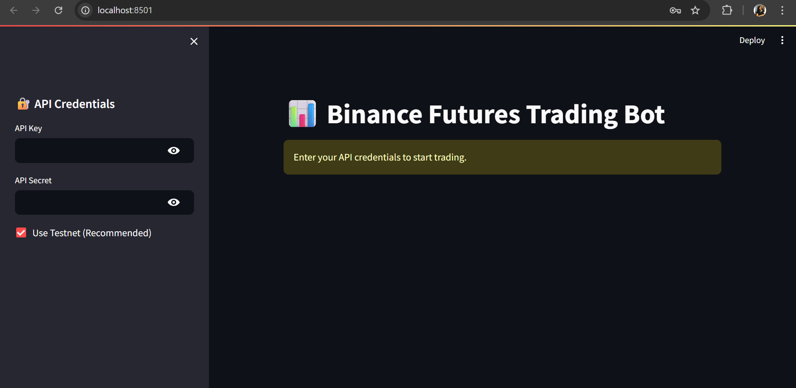
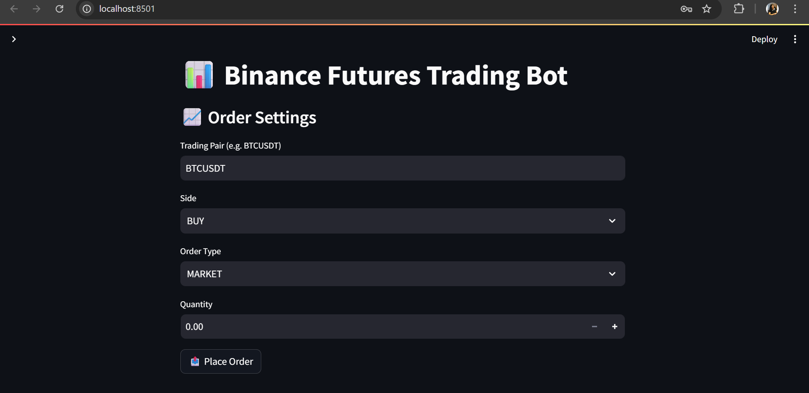
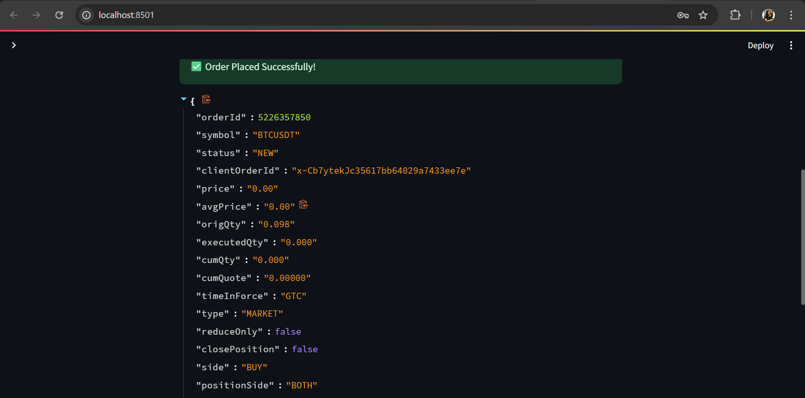

# 🧠 Binance Futures Trading Bot (Streamlit UI)

This is a simple Binance Futures trading bot built using **Streamlit** and **python-binance**. It supports placing **Market** and **Limit** orders via Binance Futures Testnet or Mainnet.

---

## 🌐 Features

- ✅ Binance Futures order placement (Market, Limit)
- ✅ Switch between **Testnet** and **Mainnet**
- ✅ Streamlit UI for easy interaction
- 🧪 Time sync handling to fix timestamp errors
- 🛠️ Modular code structure for future upgrades

---

## 🔧 Installation

1. **Clone the repo**

```bash
git clone https://github.com/yourusername/binance-bot.git
cd binance-bot
```
2. **Install dependencies**

pip install -r requirements.txt

3. **Run the App**

streamlit run binance_streamlit_bot.py

Then open http://localhost:8501 in your browser.

---

## 🧪 Testnet Credentials

1. Create a Binance Testnet account

2. Get your API Key and Secret from the testnet dashboard

3. Use those keys in the UI when prompted

---

## Screenshots

To provide a better understanding of the Student Study Portal application, here is a screenshot:

##Home Interface



##Main Interface





